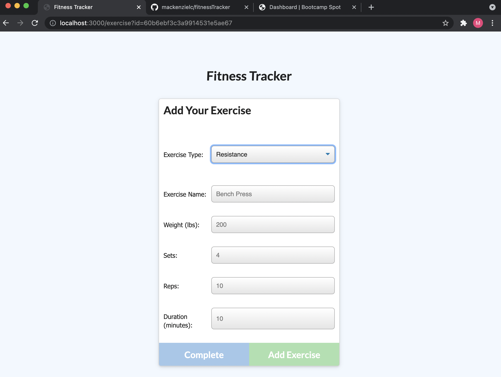
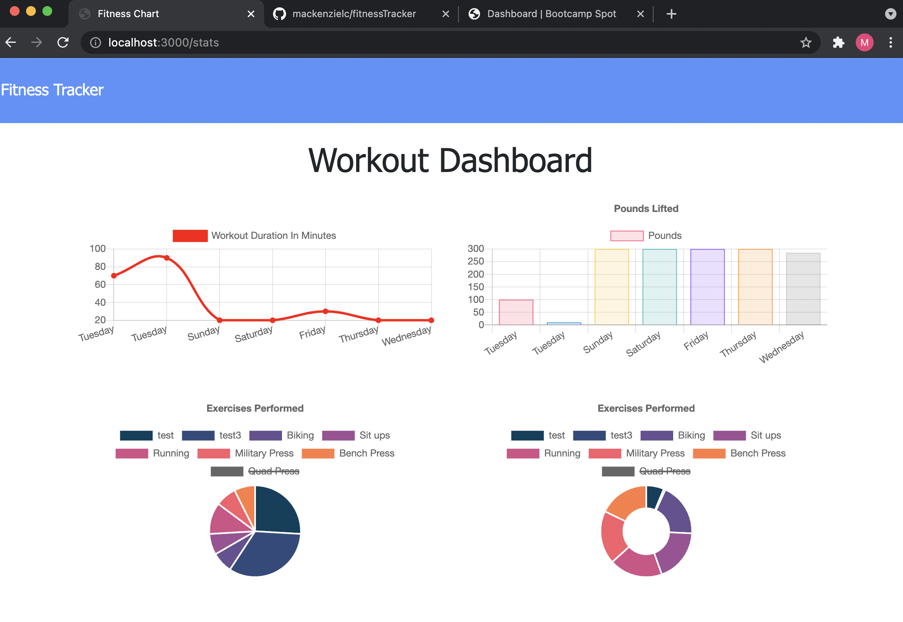

# Fitness Tracker

## Description
A workout tracker created from front end code provided by Columbia Engineering Full-Stack bootcamp with a Mongo database, a Mongoose schema and Express routes.

## User Story

As a user, I want to be able to view create and track daily workouts. I want to be able to log multiple exercises in a workout on a given day. I should also be able to track the name, type, weight, sets, reps, and duration of exercise. If the exercise is a cardio exercise, I should be able to track my distance traveled.

## Business Context

A consumer will reach their fitness goals more quickly when they track their workout progress.

## Acceptance Criteria

When the user loads the page, they should be given the option to create a new workout or continue with their last workout.

The user should be able to:

  * Add exercises to the most recent workout plan.

  * Add new exercises to a new workout plan.

  * View the combined weight of multiple exercises from the past seven workouts on the `stats` page.

  * View the total duration of each workout from the past seven workouts on the `stats` page.

  ## Mock-up 
  Deployed link: 

Homepage:
  

Form to add a new exercise to a workout:
     

User dashboard: 
  